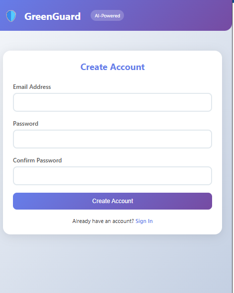
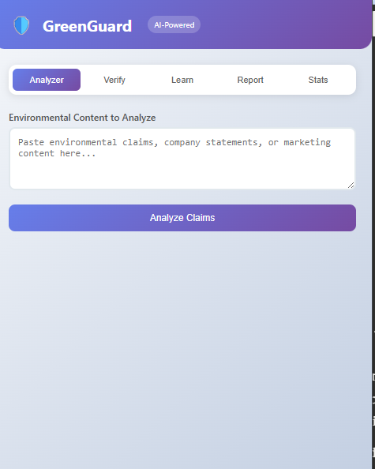
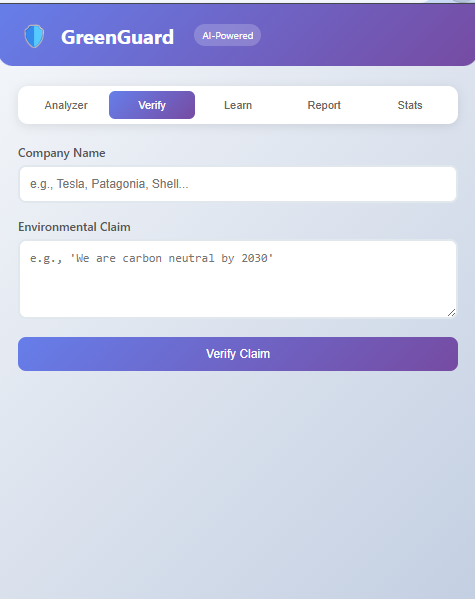
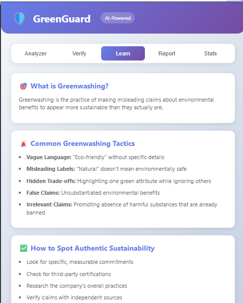
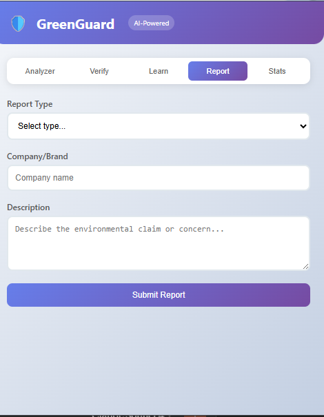
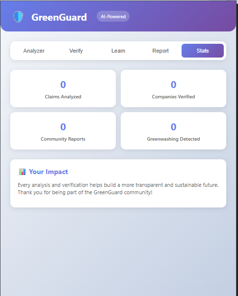
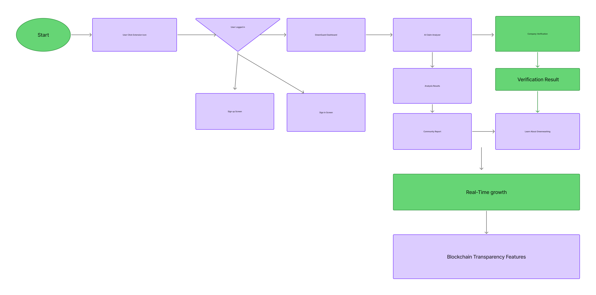

GreenGuard is an AI-powered browser extension that detects by analyzes, and
verifies corporate environmental claims in real-time.  it empowers consumers to make informed sustainable choices by identifying greenwashing tactics and providing verified environmental information at the point of decision-making.

Key Features
AI-Powered Detection uses Advanced NLP algorithms detect environmental claims and assess greenwashing risk,
Real-Time Analysis Instant processing of web content as users browse,
Claim Verification Cross-references claims with multiple environmental data sources,
Community Platform User-driven reporting and verification system,
Live Analytics Real-time statistics tracking user engagement and system performance,
Educational Content: Comprehensive resources about greenwashing tactics and sustainability,

Repository Link:
Environment Setup and Installation.

Prerequisites

python 3.10 or higher
Node.js 16+ (for development tools)
MongoDB 4.4 or higher
Chrome/Firefox browser
git

Step 1: Clone Repository

git clone <https://github.com/Islam-19984/Lastyear_capstone.git>

cd greenguard-mvp

Step 2:

cd backend
python -m venv venv

Activate virtual environment
On Windows
venv\Scripts\activate

On Mac/Linux
source venv/bin/activate

Install dependencies
pip install requirements.txt

Step 3: Database Setup

Start MongoDB service
On Windows
mongod
On Mac with Homebrew
brew services start mongodb-community

Initialize database (run from backend directory)
python init_db.py

Step 4: Start Backend Server
From backend directory with venv activated
python app.py

Step 5: Load Browser Extension For Chrome
Open chrome go to extensions
Enable "Developer mode" (top right toggle)
Click "Load unpacked"
Select the extension folder from the project directory

For Firefox:
Open about:debugging
Click "This Firefox"
Click "Load Temporary Add-on"
Select extension/manifest.json

Step 6: Test Installation

Click the GreenGuard extension icon in your browser
Sign up for a new account
Test the Analyzer feature with sample environmental content
Verify the Dashboard shows real-time statistics

Deployment Plan
Development Environment (Current)

✅ Local Flask server on localhost:5000
✅ MongoDB local instance
✅ Browser extension loaded as unpacked
✅ Development and testing complete

Designs:

Video Link:
<https://youtu.be/0_RGw42t3P0>

Repository link:
<https://github.com/Islam-19984/Lastyear_capstone/tree/main/greenguard-mvp>
